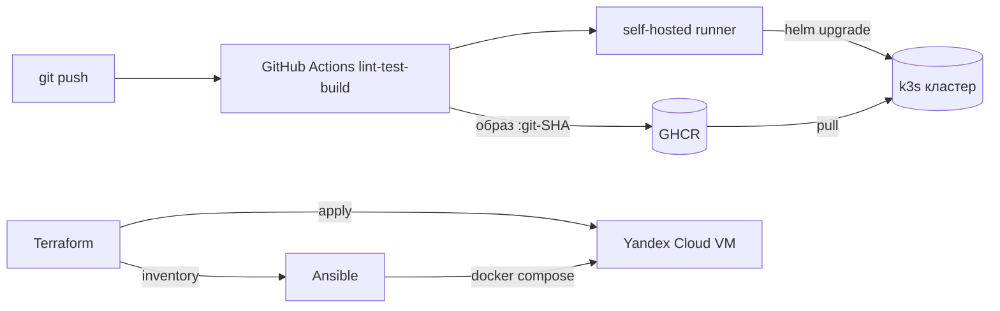
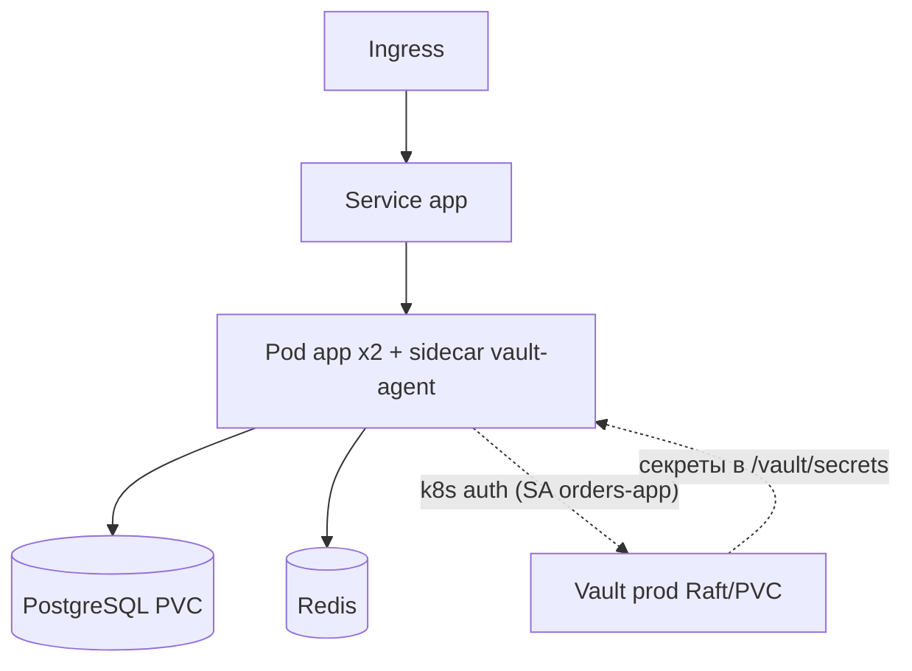
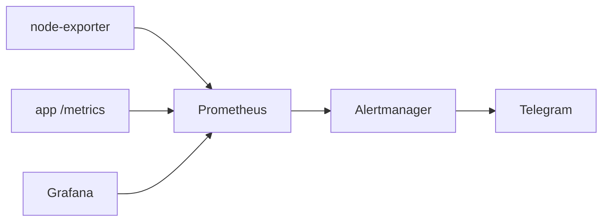

# Orders — DevOps-проект

REST API сервиса заказов для розничной сети, обёрнутый в полный production-подобный **DevOps-цикл**. Приложение здесь — реалистичная рабочая нагрузка; **фокус проекта — инфраструктура и практики вокруг него**: контейнеризация, CI/CD, Kubernetes, мониторинг, управление секретами и Infrastructure as Code.


## О приложении (кратко)

Бэкенд на Django REST Framework: поставщики загружают прайс-листы (YAML), клиенты формируют корзину из товаров разных поставщиков и оформляют заказ. Аутентификация по токену, PostgreSQL, Redis. Импорт товаров идемпотентный.

## DevOps-стек

| Слой | Технологии |
|------|-----------|
| Контейнеризация | Docker, docker-compose |
| Оркестрация | Kubernetes: self-hosted k3s (многонодовый) и Managed Service for Kubernetes (YC), Helm |
| CI/CD | GitHub Actions (+ зеркало GitLab CI), self-hosted runner |
| Registry | GitHub Container Registry (GHCR), теги = git-SHA |
| IaC | Terraform (Yandex Cloud), Ansible |
| Мониторинг | Prometheus, Grafana, Alertmanager → Telegram, node-exporter |
| Секреты | HashiCorp Vault (prod: Raft, Kubernetes auth, Agent Injector) |

## Архитектура

### CI/CD и деплой



### Runtime в Kubernetes + секреты из Vault



### Наблюдаемость



## Ключевые компоненты

- **CI/CD** (`.github/workflows/ci.yml`): линт (flake8) → тесты (pytest + Postgres) → сборка и push образа в GHCR с тегом = git-SHA → деплой в k3s через self-hosted runner (`helm upgrade --set tag=<sha>`). Уникальный тег сам триггерит rolling update.
- **Kubernetes** (`helm/orders/`): весь стек (app + PostgreSQL + Redis), Ingress, liveness/readiness-пробы, лимиты ресурсов, миграции через initContainer, разброс подов по нодам (`topologySpreadConstraints`). Многонодовый k3s.
- **Мониторинг** (`monitoring/`): Prometheus (service discovery по аннотациям, RBAC), node-exporter (DaemonSet), приложение инструментировано `django-prometheus`, дашборды Grafana (provisioning в git), алерты + доставка в Telegram (firing/resolved).
- **Секреты — Vault** (`vault/`): prod-режим (Raft-хранилище на PVC, init + unseal по Shamir 5/3). Приложение получает секреты **в рантайме** через Vault Agent Injector: sidecar логинится по Kubernetes-identity (SA `orders-app`) и рендерит секреты в файл. Статичных k8s Secret для приложения нет.
- **IaC** (`terraform/`, `deploy/`, `deploy_cloud.sh`): Terraform поднимает облачную VM в Yandex Cloud (remote state в Object Storage), Ansible ставит Docker и разворачивает приложение. `./deploy_cloud.sh` = одна команда: пустая учётка → приложение по внешнему IP.

## Запуск

### Локально (docker-compose)

```bash
cp .env.example .env    # заполнить значения
docker compose up -d --build
docker compose run --rm app python manage.py migrate
# приложение: http://localhost:8000/shops
```

### В облаке одной командой (Terraform + Ansible)

```bash
export AWS_ACCESS_KEY_ID="<static key id>"      # доступ к remote state (YC Object Storage)
export AWS_SECRET_ACCESS_KEY="<static key secret>"
./deploy_cloud.sh                                # apply -> ждём SSH -> ansible -> внешний IP
# снести: cd terraform && terraform destroy -auto-approve
```

### В Kubernetes (Helm)

```bash
helm upgrade --install orders helm/orders -n orders --create-namespace
kubectl -n orders get pods
```

## Структура репозитория

```
.
├── orders/                  # Django-приложение (API, модели, тесты)
├── Dockerfile               # образ приложения (gunicorn)
├── docker-compose.yml       # локальный стек: app + PostgreSQL + Redis
├── requirements.txt
├── .github/workflows/ci.yml # CI/CD: lint - test - build - deploy
├── .gitlab-ci.yml           # зеркало пайплайна на GitLab CI
├── deploy/                  # Ansible: playbook, inventory, шаблон .env
├── deploy_cloud.sh          # «одна кнопка»: Terraform apply - Ansible deploy
├── k8s/                     # базовые k8s-манифесты
├── helm/orders/             # Helm-чарт приложения (основной способ деплоя)
├── monitoring/              # Prometheus, node-exporter, Grafana, Alertmanager
├── vault/                   # Vault (prod StatefulSet), demo, unseal.sh
├── backup/                  # CronJob'ы бэкапов (pg_dump, снапшот Vault) в Object Storage
├── deploy_mks.sh            # «одна кнопка» для Managed k8s: apply - kubeconfig - helm - LoadBalancer
├── terraform-mks/           # IaC для Managed Service for Kubernetes (свой ключ стейта)
└── terraform/               # IaC для Yandex Cloud + remote state
```

## Облачная доводка «как в бою» (сделано)

Поверх локального стека доведено до production-подобного состояния в облаке (Yandex Cloud), всё воспроизводимо и сносится одной командой:

- **Облачный k3s одной кнопкой** (`deploy_cloud_k8s.sh`): Terraform поднимает VM, Ansible ставит k3s+Helm и катит тот же чарт, что и локально.
- **HTTPS без покупки домена**: cert-manager + Let's Encrypt (HTTP-01), DNS через `sslip.io`.
- **Vault prod + auto-unseal через YC KMS**: unseal-ключи хранятся зашифрованными KMS, sidecar сам распечатывает Vault после рестарта (IAM-токен из metadata привязанного к VM SA).
- **Postgres берёт пароль из Vault** (`POSTGRES_PASSWORD_FILE` + Agent Injector) — статичных секретов приложения/БД не осталось.
- **Stateful-мониторинг + бэкапы**: Prometheus/Grafana на PVC (retention 15d), CronJob'ы `pg_dump` и Vault-снапшота в Object Storage.
- **Managed Service for Kubernetes** (`terraform-mks/`, `deploy_mks.sh`): тот же стек в управляемом кластере YC — control-plane обслуживает провайдер, kubeconfig через `yc get-credentials`, приложение снаружи через `Service type=LoadBalancer` (YC NLB). Отдельный ключ стейта, без SSH/Ansible — прямой контраст с self-hosted k3s.

Оставшиеся лабораторные компромиссы (сознательно): Vault на одной ноде (не HA), секрет доступа к S3-бэкапам в k8s Secret (в проде — тоже в Vault), расширение покрытия тестами.

